# Blinkit Assembly

## Tools Required
* Soldering iron
* Solder
* Flush cutters
* Wire strippers
* Small screwdriver

## Technique
This is a relatively simple build, and with little to no experience can be completed successfully.

Several steps will make use of a technique called `tacking` to make sure a piece is properly aligned. This is done by soldering 1 outer pin, then adjusting the part while keeping the solder melted with the iron. **It is important to not touch any metal part of the piece that is being heated.** Don't keep the iron on the joint for too long, if you find it hard to get the pins lined up, try using tape to help hold it in place.

## Procedure
#### Step 1 - Infrared LED

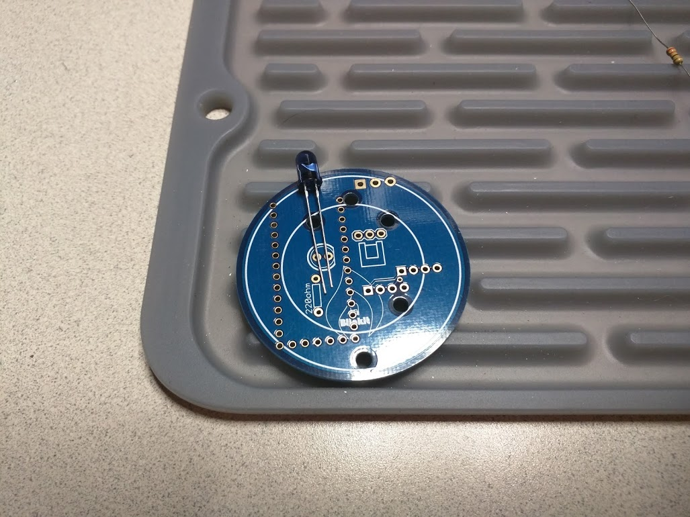

Pay attention to the orientation of the LED. On the board there is a flat side that matches with a flat side on the LED. This is also the shorter pin.

#### Step 2 - LED Resistor

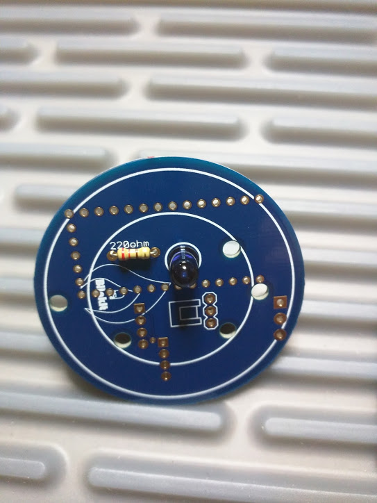

After finishing soldering the LED and resistor, use a pair of flush cutters to trim the leads to the board.

#### Step 3 - Teensy header

Place the headers on the back side of the board

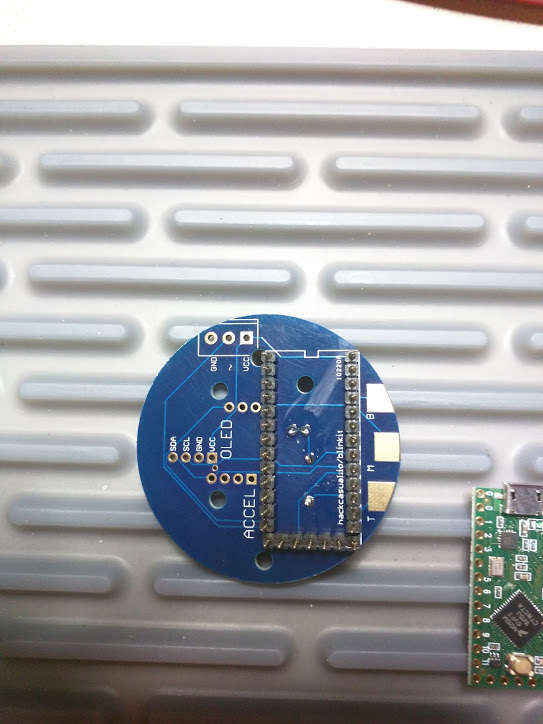

A little piece of tape will help hold the pins in place

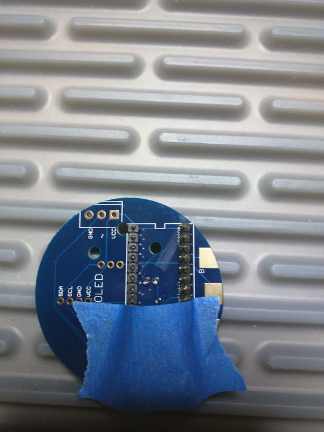

Solder just 1 pin from each header (3 pins total) to tack the headers in place

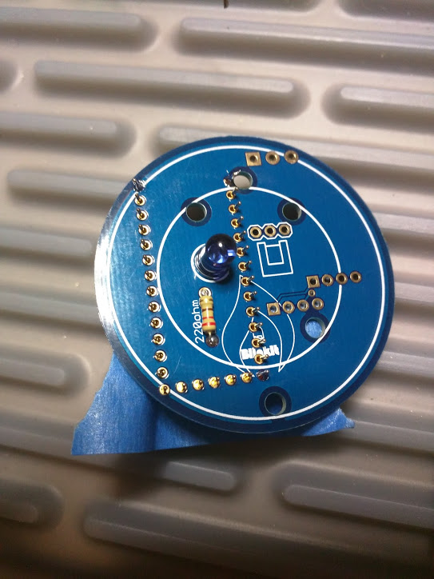

#### Step 4 - Install Teensy

Mount the Teensy to the headers. If the pin alignment is off, re-solder the pin and realign.

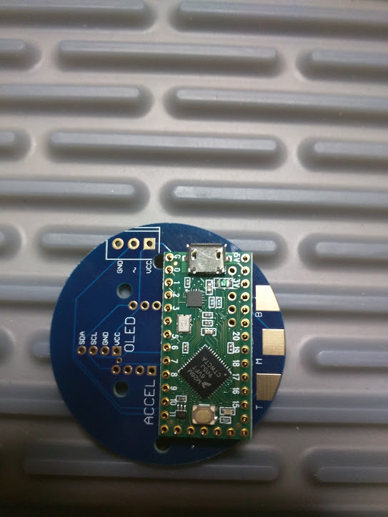

Solder the pins on top of the Teensy and then solder the rest of the Teensy header pins on the front of the board

#### Step 5 - Install IR receiver

Insert the receiver on the front of the board, so the flat back of the package goes against the board

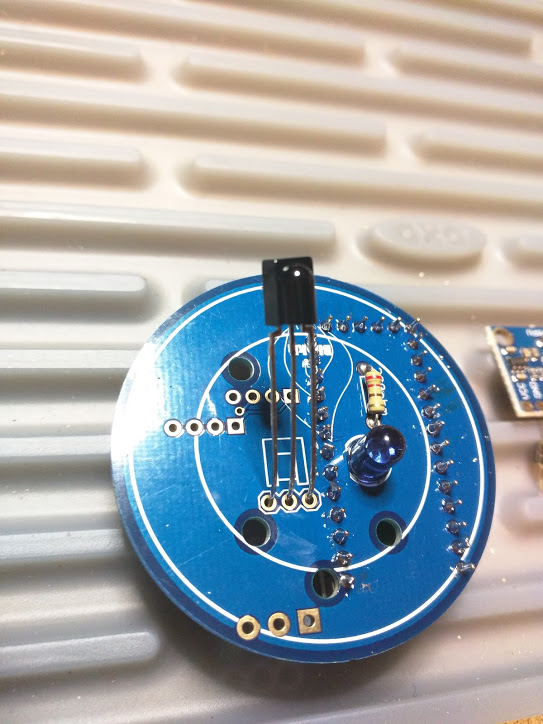

Fold the body of the receiver so it is flat against the board, solder the pins then flush cut the excess

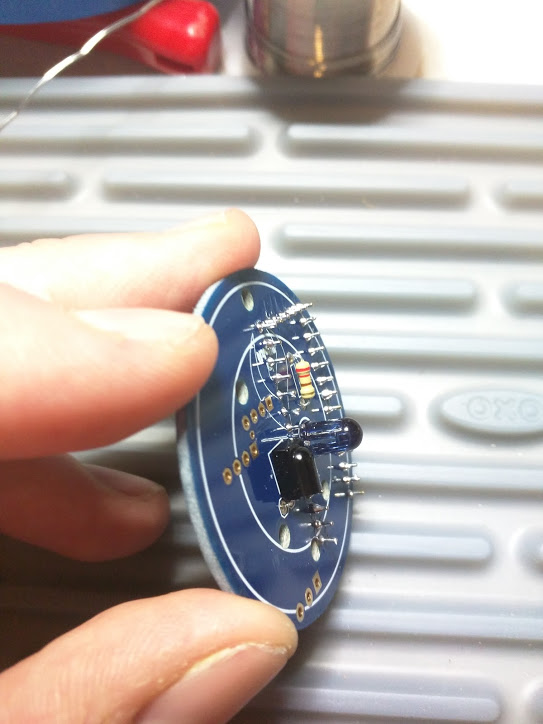

#### Step 6 - Accelerometer
Solder the header onto the back of the board. It is important that the header is straight, so tack 1 pin and straighten the header before soldering the rest.

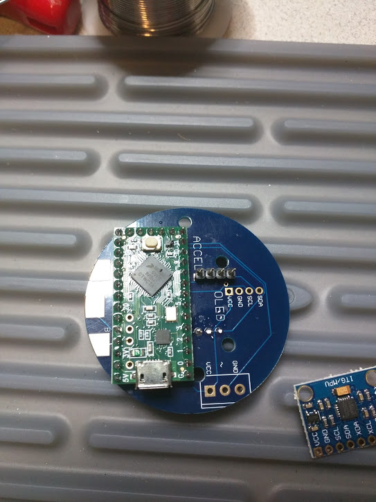

Next, mount the accelerometer, so that the Vcc pin is closest to the Teensy, and facing up.

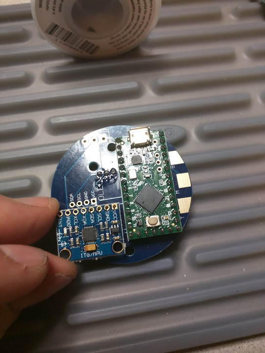

Tack the Vcc pin, and adjust until the board is flat and square with the teensy.

#### Step 7 - OLED header

Just like the accelerometer header, tack 1 pin, then align, and solder the rest

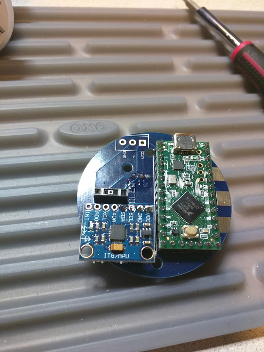

#### Step 8 - Screw Terminal

Install the screw terminal, so that the gates (metal teeth) face away from the board

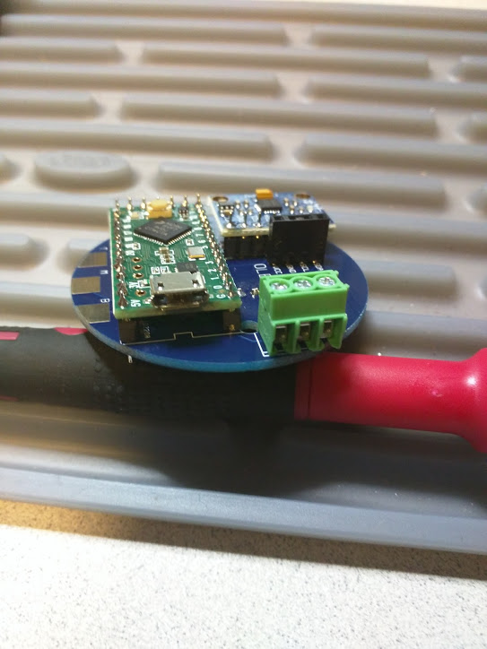

#### Step 9 - Wire up LED Ring

First, strip one end of the wires, about 1/8"

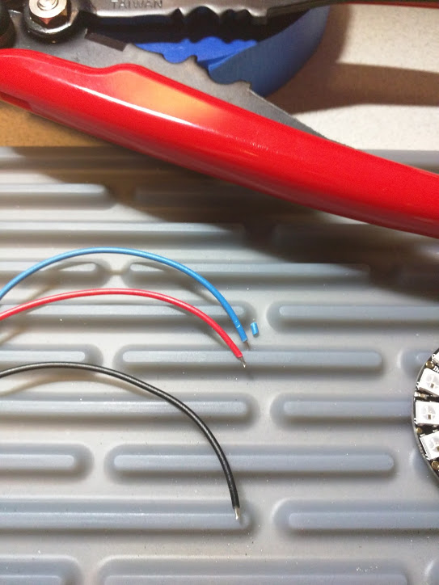

Soldering the wire to the PCB can be tricky as there is very little room. The wires are stiff enough to hold the board up a little bit so that you have 2 hands free to solder the ends.

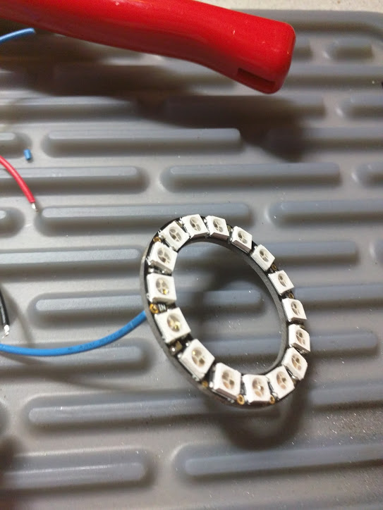

The connections are
* Red to Power
* Black to Ground
* Blue to Data In

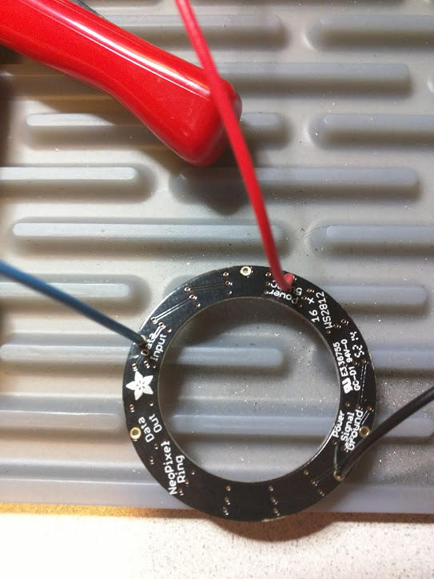

#### Step 10 - Mount the ring
Fold the wires under the board to provide some space between it and the front of the main PCB.

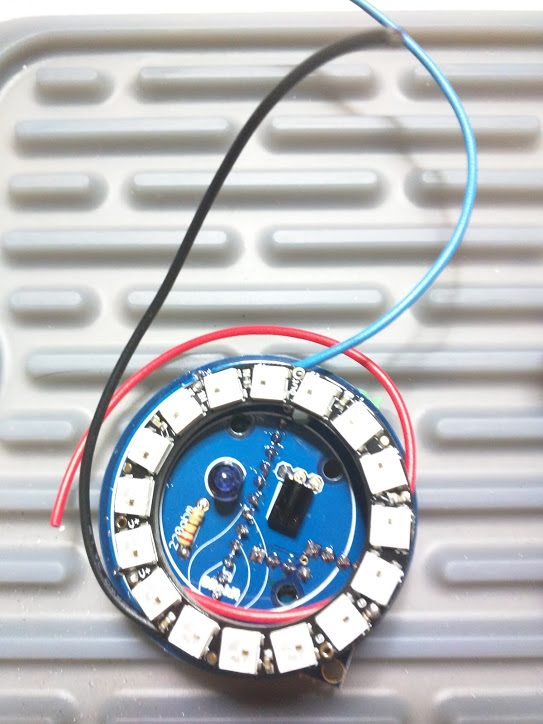

Insert zip ties into each of the 3 holes that are inside the inner ring on the board. Wrap them around and loosely connect them.

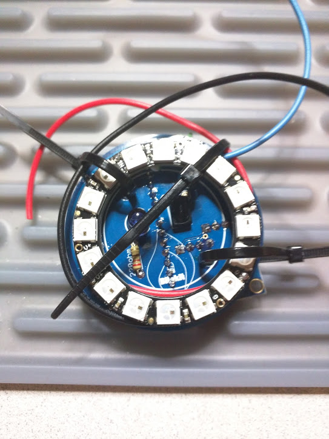

Gather the ends of the wires together near the screw terminal, and cut them to the same length, leaving about 3/4" to fold over into the screw terminal.

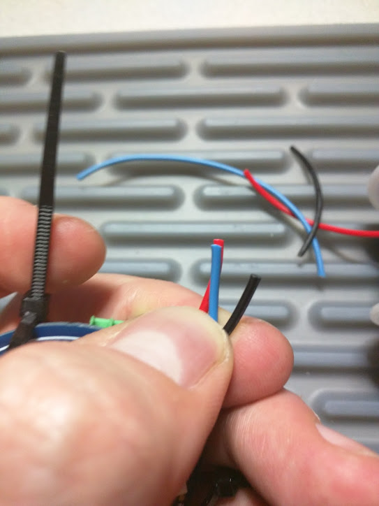

Strip the ends, and then insert them into the screw terminal

* Red to Vcc
* Blue to ~
* Black to Gnd

Tighten the screws for the terminal

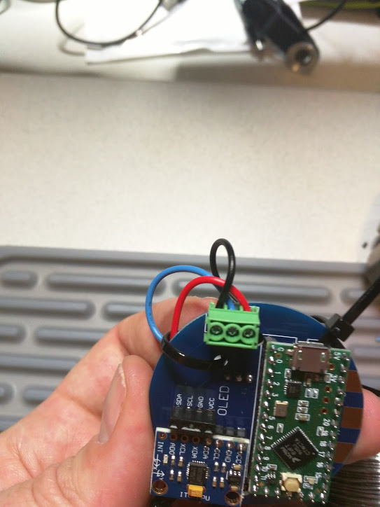

To finish, pull the zip ties so that the ring is held loosely in place. It should have a small amount of distance from the pins on the main board and a little wiggle room. **If you find that the board won't power on or the LEDs won't light up, make sure to loosen the ties for the board**

## Smoke Test
Connect the Teensy to your computer. If this is a new Teensy, you will see an LED flash on it, every 0.5 seconds. From the Arduino software, select one of the BDK examples to confirm that the rest of the components are functioning.

## Have fun!
